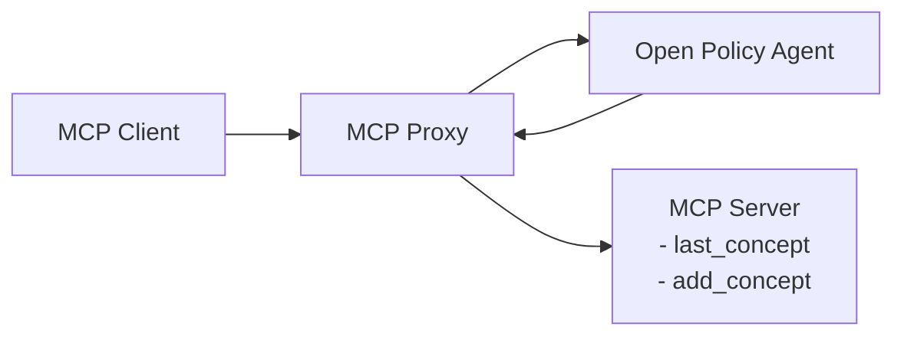
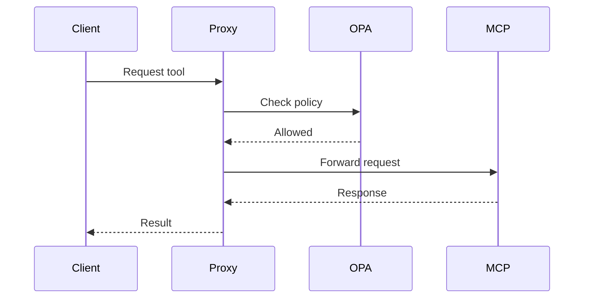
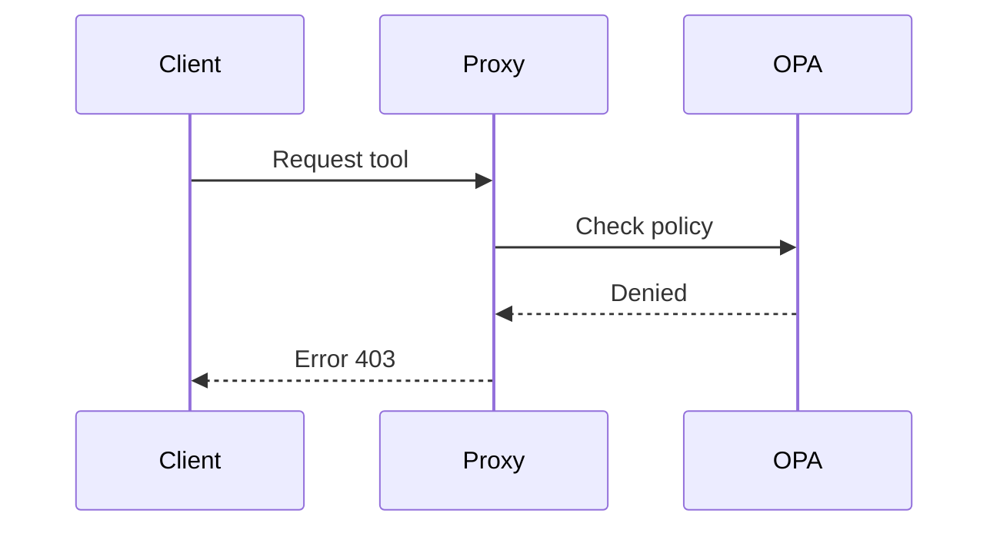

# Proof of Concept: MCP Tool Blocking with OPA

## 🎯 Objective

This project demonstrates how to restrict access to specific **tools** of an MCP server using **Open Policy Agent (OPA)** as a policy engine.

A **proxy** is implemented to intercept MCP client requests, query OPA to check if the action is allowed, and then either forward or block the request accordingly.

---

## 🚀 Getting Started

To start the full environment with MCP, OPA, and the proxy:

```bash
poe run
```

This will start:

* MCP server
* MCP proxy
* OPA with the defined policy

The MCP client runs from the **host** (outside Docker) using commands defined in `pyproject.toml`:

```bash
poe question_allowed
poe question_not_allowed
```

---

## 🛠️ Implementation

* **MCP server** with two tools:

  * `last_concept`: retrieves the latest recorded concept.
  * `add_concept`: adds a new concept and expense.
* **MCP proxy** intercepts all client requests.
* **OPA** evaluates policies before forwarding requests.
* If OPA allows → request is forwarded.
* If OPA denies → proxy returns an error to the client.

---

## 🏗️ Architecture



---

## ⚙️ Workflow

1. MCP client requests a tool.
2. Proxy intercepts the request and extracts relevant info.
3. Proxy queries OPA.
4. If OPA returns **allowed**, request is forwarded to MCP.
5. If OPA returns **denied**, proxy returns a 403 error.

---

## 📌 Usage Example

* Tool `add_concept` → blocked by OPA policy.
* Tool `last_concept` → allowed.

The client can only execute tools permitted by the policy.

---

## 🔐 OPA Policies

Example policy (`policies/policy.rego`):

```rego
package mcp

import rego.v1

default allow := true

allow := false if {
  input.name == "add_concept"
}
```

➡️ With this policy, **only** `add_concept` is denied. All others are allowed by default.

---

## ✅ Results

### Case 1: Allowed tool

```bash
❯ poe question_allowed
...
The last concept is: (server response)
```

### Case 2: Denied tool

```bash
❯ poe question_not_allowed
httpx.HTTPStatusError: Client error '403 Forbidden'
```

---

## 📊 Flow Diagrams

### Allowed tool



### Denied tool



---

## 📚 References

* [Open Policy Agent](https://www.openpolicyagent.org/)
* [Model Context Protocol (MCP)](https://github.com/modelcontext/modelcontext-protocol)
